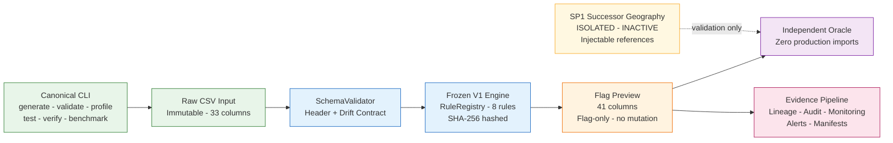
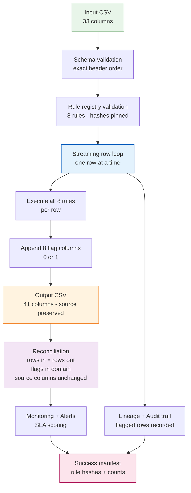
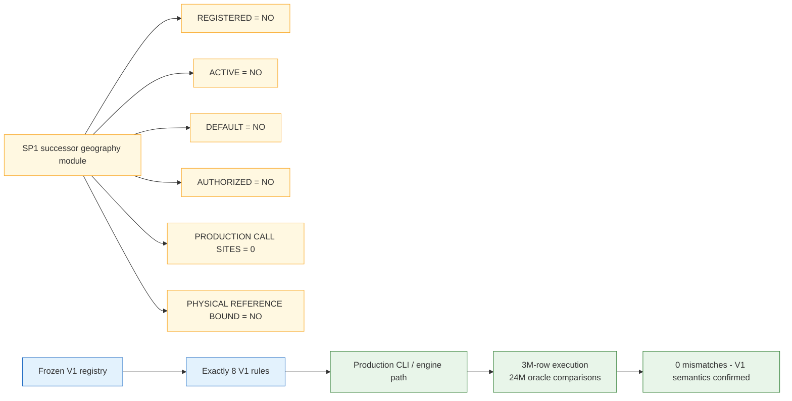
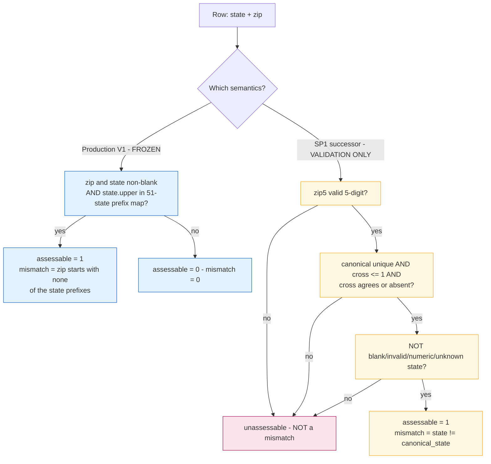
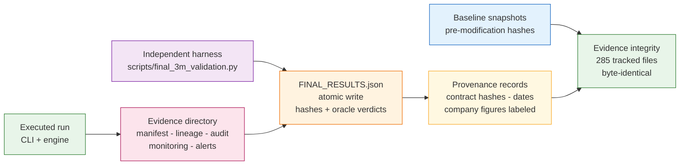

# Data Quality Validation Platform

> **V1 frozen rule engine · FRESH 3,000,000-row validation executed 2026-09-10 with an independent oracle (48,000,000 comparisons, 0 mismatches) · historical 5M dataset forensically verified · SP1 successor geography contract implemented for validation only · nothing pushed, nothing activated**

[](#validation-verdict)
[](#3m-validation)
[](#independent-oracle)
[](#how-to-run-tests)
[](#sp1-successor-contract)

Every claim below is labeled with its evidence class:

- **VERIFIED LOCALLY** — executed and measured in this repository
- **COMPANY-SUPPLIED** — provided by the company; not independently reproduced
- **HISTORICAL** — preserved evidence of earlier executions (2026-09-09 or earlier); not re-executed
- **NOT LOCALLY VERIFIED / NOT EXECUTED / NOT AUTHORIZED** — explicitly not claimed

## Executive Summary

The Data Quality Validation Platform V2 is a **flag-only** validation engine for 33-column consumer contact datasets. The frozen **V1** layer (8 rules, 33→41 column contract, prefix-map geography semantics, rule hashes, golden fixtures) has never been modified since the audited baseline `ecf476a`. On **2026-09-10** a **fresh, real 3,000,000-row validation** was executed end-to-end through the production CLI with a **from-scratch independent oracle**: **24,000,000 flag comparisons per pass, 0 mismatches, byte-identical outputs on a repeated full double-pass execution**, and peak engine memory of **2226.79 MB**. The full test suite stands at **423 collected / 414 passed / 9 skipped / 0 failed**, including 23 new hardening regression tripwires added by this final task.

The **SP1 successor geography contract** (Gulnara, prepared 2026-09-01, superseding the old SP1 policy) is implemented in an isolated, injectable module and validated locally by **132 targeted tests** — while remaining **inactive, non-default, not production validated, and not authorized for execution**. The authoritative DL001–DL015 fixture was never delivered; its absence is preserved (7 tests skip-gated) and the known **8-of-12 derived divergence** is reproduced independently and pinned as a regression test. No ClickHouse connection, no production mutation, no E1, and no push to GitHub has occurred at any point.

## Current Status

| Area | Status | Evidence class | Result |
|---|---|---|---|
| V1 rule engine | PASS | VERIFIED LOCALLY | Frozen, versioned, SHA-256 identified; byte-identical to baseline `ecf476a` |
| Fresh 3M validation (2026-09-10) | PASS | VERIFIED LOCALLY | 2 full passes; 3,000,000 rows in/out each; oracle 0 mismatches; byte-identical |
| Historical 3M execution (2026-09-09) | PASS | HISTORICAL | 2 complete runs; 48M comparisons; 0 mismatches |
| 5M dataset integrity | PASS | HISTORICAL | 5,000,000 rows × 33 columns; IDs 1..5,000,000; SHA-256 verified |
| 5M stress execution | DOCUMENTED LIMITATION | HISTORICAL | 4,943,922 / 5,000,000 rows (98.9%) before kernel OOM at ~3.59 GB |
| Independent oracle | PASS | VERIFIED LOCALLY | 48,000,000 comparisons (2 × 24,000,000); 0 mismatches |
| Determinism | PASS | VERIFIED LOCALLY | Fresh double-pass: input hash equal, output hash equal, byte-identical files |
| Test suite | PASS WITH BOUNDED SKIPS | VERIFIED LOCALLY | 423 collected / 414 passed / 9 skipped / 0 failed (2026-09-10, post-hardening) |
| Geography V1 | PASS WITH LIMITATIONS | VERIFIED LOCALLY | Frozen prefix-map semantics only; known boundaries documented |
| SP1 successor geography | INACTIVE | VERIFIED LOCALLY | 132/132 targeted tests; not registered, not default, no production call sites |
| SP1 activation | NOT AUTHORIZED | NOT EXECUTED | No activation; no physical reference binding |
| DL001–DL015 authoritative table | COMPANY-GATED | NOT LOCALLY VERIFIED | Fixture never delivered; 7 tests skip-gated; no fabrication |
| DL derived divergence (8/12) | REPRODUCED | VERIFIED LOCALLY | Derived analysis on controlled inputs; pinned by regression test |
| ClickHouse | NOT RUNTIME EXECUTED | NOT EXECUTED | No client, no connections, no mutations |
| Airflow | STATICALLY VERIFIED | VERIFIED LOCALLY | DAG structure verified; runtime unavailable/not installed |
| E1 | NOT IMPLEMENTED / NOT EXECUTED / NOT AUTHORIZED | NOT EXECUTED | Zero E1 identifiers in production packages (tripwire-pinned) |
| R3 formula | UNRESOLVED | COMPANY-SUPPLIED | Business meaning approved; exact computational formula unresolved |
| 721M population figures | COMPANY-SUPPLIED | COMPANY-SUPPLIED | Historical measurements; not locally reproduced |
| Git remote | UNTOUCHED | VERIFIED LOCALLY (local refs) | `origin/main` still `ecf476a`; all work committed locally only |

## Validation Verdict

**PASS WITH DOCUMENTED LIMITATIONS** — the strongest conclusion the evidence supports:

> The frozen V1 platform is **independently validated at the 3,000,000-row execution scale**, now with **two independent validation generations**: the historical 2026-09-09 execution (seed 20260909) and the fresh 2026-09-10 execution (seed 20260910), each run twice with byte-identical outputs and **48,000,000 independent flag comparisons producing zero mismatches** per generation. The SP1 successor geography contract is **defined and locally implemented/tested** under the authoritative 2026-09-01 contract, while remaining inactive, non-default, not production validated, and not authorized for execution.

What this verdict deliberately does **not** claim: 5M completion, live ClickHouse execution, Airflow runtime execution, company-authoritative DL acceptance, E1 authorization, SP1 production activation, or any production readiness beyond the locally proven scope.

## Architecture



Boundaries (fail-closed by construction):

- **No database client exists anywhere in the platform** — there is no connector to harden or to accidentally fire.
- The Airflow DAG and ClickHouse DDL files are **static templates** with no runtime execution path.
- The SP1 successor module has **zero non-test importers** and is not present in the production registry.

## Data Flow



Row-level guarantees (each verified at 3M scale in both passes): row identity (`id` = row position, 1..N), row ordering (output row *i* corresponds to input row *i*), source immutability (all 33 source values byte-equal per position; input file hash unchanged after validation), output shape (exactly 41 columns in pinned order; every flag ∈ {0, 1}).

## V1 Frozen Contract

**VERIFIED LOCALLY — byte-identical to the pre-modification baseline (`ecf476a`):**

- `data_quality_platform/rules/v1_rules.py` — SHA-256 `daef1ded54c7d3c7…`
- `data_quality_platform/rules/registry.py` — SHA-256 `bea2ab41d7c3237c…`
- `data_quality_platform/contracts.py` — SHA-256 `b3eea54f0c5142e6…`
- All three golden fixtures — `9ff2364f…` / `fd2d9783…` / `c5084feb…`
- Engine and schema validator — zero diff vs `ecf476a`

Contract pins: exactly **8 rules** (registry live-enumerated), **33 input columns**, **41 output columns**, `OUTPUT_COLUMNS == SOURCE_COLUMNS + FLAG_COLUMNS`, **51-state prefix map**, 19 suspicious name patterns, rule order unchanged, prefix-map geography semantics frozen (including its known limitations — see [Geography Logic](#geography-logic)). Live rule hashes match `evidence/final_execution/rule_matrix.json` (8/8, `implementation_hash_head`) and the flagship run manifests (8/8).

## Eight V1 Rules

| # | Rule ID | Semantics (frozen) |
|---:|---|---|
| 1 | `first_name_cleaning_candidate` | blank→0; suspicious substring (19 patterns, case-insensitive) / non-alpha char (Unicode `isalpha`, hyphen and apostrophe allowed) / repeated single char after removing `-`/`'` → 1 |
| 2 | `last_name_cleaning_candidate` | same predicate family on `last_name` |
| 3 | `name_cleaning_candidate` | both blank→0; both non-blank and equal (case-insensitive)→1; both single chars→1 |
| 4 | `email_blank` | `email_address` is None or strips to empty → 1 |
| 5 | `email_syntax_failure` | non-blank email not matching `^[a-zA-Z0-9._%+\-]+@[a-zA-Z0-9.\-]+\.[a-zA-Z]{2,}$` → 1 |
| 6 | `proposed_email_export_eligible` | non-blank email matching the pattern → 1 |
| 7 | `zip_state_assessable` | zip and state both non-blank and `state.upper()` in the 51-state prefix map → 1 |
| 8 | `geography_mismatch_candidate` | requires assessable; 0 if any prefix of the state's map is a prefix of the trimmed zip, else 1 |

Every rule returns exactly 0/1, carries version `1.0.0`, a SQL template, and a SHA-256 implementation hash. Rule semantics are frozen — including known V1 behaviors such as: states outside the 51-state map (GU, PR, AA…) are **not assessable** under V1, and an in-map state with a malformed non-empty ZIP scores **mismatch=1** (prefix check simply fails). These behaviors are the audited baseline and are intentionally preserved; the SP1 successor exists precisely because the company's successor contract changes them.

## 33 → 41 Column Contract

Input: exactly 33 columns in pinned order —
`id, email_address, first_name, last_name, address, city, county_name, state, zip, website_source, phone_number, gender, dob, registration_date, valid, extra, email_id, ethnicity, ownrent, domain, main_interest, sub_interest, latitude, longitude, uploaded, country, websource_id, interest_ids, DNC, source, first_name_norm, last_name_norm, zip_norm`

Output: the same 33 columns **byte-preserved in order**, plus the 8 flag columns appended in the order listed above = **41 columns**. The engine never rewrites, trims, or reorders source values; it only appends flags. Verified at 3M scale by the independent oracle (all 33 values compared per row, per position).

## SP1 Successor Contract

The **authoritative current contract** is the Gulnara successor geography document ("Geography rule - canonical definition and acceptance cases", prepared **2026-09-01**, measurements 2026-08-31), which **supersedes the old SP1 policy** (`exclude when zip_state_assessable = 0 OR geography_mismatch_candidate = 1` — retained only as frozen V1 history).

**Selection policy (per targeted geography field):**

```
exclude when:
    geography_mismatch_candidate = 1
    OR
    NOT field_present(requested geography field)
```

Core principle: **UNASSESSABLE ≠ MISMATCH** — an unassessable row is not a negative geography finding; only a mismatch row (assessable by definition) is excluded on geography grounds. Presence is evaluated **per field, not once per row**.

**`zip_state_assessable` (successor):**

```
zip5 = trimmed_zip if matches ^[0-9]{5}$ else ''

reference_resolved =
    zip5 != ''
    AND canonical_state_count = 1
    AND cross_state_count <= 1
    AND (cross_state_count = 0 OR canonical_state = cross_state)

zip_state_assessable =
    reference_resolved
    AND NOT blank_state
    AND NOT invalid_state_format
    AND NOT numeric_state_review
    AND NOT unknown_state_code
```

with `blank_state = state = ''`; `invalid_state_format = state != '' AND NOT ^[A-Za-z]{2}$ AND NOT all-digits`; `numeric_state_review = state != '' AND all digits`; `unknown_state_code = two letters AND not in the approved 62-code allowlist` (50 states + DC + 8 territories + 3 military codes, including GU/AS/AA/AE/AP — repository allowlist **counted and verified: exactly 62 codes including WY**). All fields are text; whitespace trimmed; NULL = empty; state uppercased.

**`geography_mismatch_candidate` (successor):** `zip_state_assessable AND consumer_state != canonical_state` — evaluated only when assessable.

**Reference model:** two references (canonical + cross), each filtered to valid 5-digit ZIPs and two-letter states: canonical must resolve a ZIP to exactly one state; cross may be absent (not a conflict) or agree; cross disagreement or canonical ambiguity → not assessable. The physical reference datasets (derived from `tips_data.tblZipStCtyIB`) are **not available** in this repository — per the no-fabrication rule, no physical binding is configured; the successor is implemented behind an injectable `TwoReferenceProvider` and all tests use clearly-labeled validation fixtures only.

**Isolation — verified live and pinned by regression tripwires:**



| Status field | Value |
|---|---|
| DEFINED | YES |
| IMPLEMENTED_FOR_VALIDATION | YES |
| ACTIVE | NO |
| DEFAULT | NO |
| PRODUCTION_VALIDATED | NO |
| AUTHORIZED_TO_EXECUTE | NO |

## Gulnara Requirements

The successor implementation was reconciled **clause-by-clause (35/35 PASS)** against the 2026-09-01 contract, and is covered by **132 targeted tests** (`tests/unit/test_sp1_geography_contract.py` — 63, and `tests/unit/test_sp1_successor_contract_validation.py` — 69). The seven authoritative acceptance cases pass verbatim:

| # | State / ZIP | assessable | match | mismatch | Note |
|---|---|---:|---:|---:|---|
| 1 | CA / 90210 | 1 | 1 | 0 | baseline match |
| 2 | CA / 00USA | 0 | 0 | 0 | malformed ZIP → unassessable, NOT mismatch |
| 3 | CA / 0 | 0 | 0 | 0 | unassessable |
| 4 | CA / 000CA | 0 | 0 | 0 | unassessable |
| 5 | CA / "015 8" | 0 | 0 | 0 | unassessable |
| 6 | WA / 99501 | 1 | 0 | 1 | canonical resolution = AK |
| 7 | GU / 96910 | 1 | 1 | 0 | GU recognized; cross row absent is NOT a conflict |

The test matrix additionally covers: zip5 normalization (null/blank/whitespace/malformed/6-digit/alphanumeric), numeric state, invalid state format, unknown state code, lowercase and whitespace state, canonical match/mismatch, reference conflict, canonical ambiguity, cross agreement/conflict/absence, and field presence per field — plus determinism and audit-safety invariants (no clocks, no randomness) and novel edge cases (mixed-case state, whitespace-padded state, leading-zero ZIP) added by the 2026-09-10 hardening tests.

## Geography Logic

Two coexisting, clearly separated geography semantics:



**V1 known limitations (frozen, documented, not defects of this task):** 13 ambiguous ZIP prefixes shared across states; DC's duplicate prefix representation (`"20","20"`); 11 authoritative territory/military codes absent from the V1 map (8 territories + 3 military/APO/FPO — e.g. GU/PR rows are invisible to V1 assessability); the documentation-only exclusion policy; and the known Austin false-positive golden cases (bounded and pinned by tests).

**V1 vs successor divergence is real and reproduced:** on the 12 exactly-specified DL cases, the frozen V1 prefix map and the successor canonical model disagree on exactly 8 (see [DL001-DL015 Status](#dl001-dl015-status)). This is the audited reason the successor exists — V1 is not "repaired"; both semantics are kept, one frozen in production, one validated in isolation.

## Field Presence

Evaluated **per requested geography field, independently** (successor contract):

```
field_present(zip)     = zip5 != ''
field_present(state)   = NOT blank AND NOT invalid-format AND NOT numeric-review AND NOT unknown-code
field_present(city)    = trimmed city != ''
field_present(address) = trimmed address != ''
field_present(county)  = NOT DEFINED (refused — no invented logic)
field_present(country) = NOT DEFINED (refused — no invented logic)
```

Example from the contract: a row with a **valid state and a malformed ZIP** is *present* for state-targeted selection and *not present* for ZIP-targeted selection. County/country are out of scope; the implementation raises rather than inventing presence logic (verified by tests, including the unknown-field-refused case).

## DL001-DL015 Status

- The authoritative fixture `tests/golden/dl_geography_cases.csv` **was never delivered** and **does not exist** in this repository (verified by file check and `git ls-files`). The 7-test DL module is **skip-gated by design** and the table is "never reconstructed" — no synthetic authoritative fixture was created, ever.
- Per the authoritative description, the prefix-map (frozen V1) and canonical expected outputs disagree on **8 of 15** cases; **DL013 (UT / 84501) is a control case** — a shared ZIP prefix (845 spans UT and OK) is not automatically erroneous.
- **DERIVED reproduction (VERIFIED LOCALLY, clearly labeled as derived — NOT authoritative):** the real frozen V1 rules executed against contract-derived canonical expectations on the 12 exactly-specified cases reproduce **exactly 8 disagreements** (DL001, DL002, DL003, DL010, DL011, DL012, DL014, DL015) and 4 agreements (DL004, DL008, DL009, DL013). DL012/DL015 verdicts are robust to alternative reference resolutions; DL005/DL007 provably agree for all probe ZIPs; DL006 is consistent under the non-US-state reading. This fact is now **pinned by a permanent regression test** (`tests/unit/test_final_3m_hardening.py::TestDLDerivedDivergencePinned`) and reproduced fresh in `evidence/final_3m_validation/phase10_dl_divergence_reproduction.txt`.
- **NOT CLAIMED:** "15/15 authoritative DL cases verified". The authoritative count remains unverified against the external table because it was never delivered.

## 3M Validation

**VERIFIED LOCALLY — fresh execution on 2026-09-10** (`scripts/final_3m_validation.py`, evidence in `evidence/final_3m_validation/`):

| Metric | Value |
|---|---:|
| Rows | 3,000,000 (both passes) |
| Columns | 33 in → 41 out |
| Seed | 20260910 (deterministic, documented) |
| Input SHA-256 | `208154653ca965dd50a27c8a7b42e59ef2c7d65e6353ffb1d156b8c3029f1a6f` |
| Output SHA-256 | `b02872e3ee0a1471c369793a76e292758e339a199ef7253c84d91152f657af69` |
| Input size | 734,288,183 bytes |
| Output size | 782,288,380 bytes |
| Total staged runtime | 573.965 s (2 full passes: generate+validate+verify each) |
| Stage runtimes | generation 82.6 s / 81.4 s · validation 115.8 s / 113.8 s · verify+oracle 65.4 s / 66.0 s |
| Peak engine RSS | **2226.79 MB** (pass 1) / 2222.93 MB (pass 2) — `RUSAGE_CHILDREN`, post-exit |
| Production path | canonical CLI subprocess (`python -m runner.cli validate`) — the real production entry point |
| Verdict | `Validation PASSED: 3000000 rows in, 3000000 rows out`, reconciliation passed |

Structural checks (both passes): schema PASS · row count PASS · column count/order PASS · row identity (id = 1..3,000,000, no gaps/dupes) PASS · row ordering PASS · source values preserved PASS · output shape PASS · flag domain PASS · SP1 isolation PASS (engine manifest contains exactly the 8 V1 rules).

Flag counts on the fresh dataset (both passes identical — the dataset intentionally exercises edge rates):

| Flag | Count | Share |
|---|---:|---:|
| `first_name_cleaning_candidate` | 475,812 | 15.86% |
| `last_name_cleaning_candidate` | 239,623 | 7.99% |
| `name_cleaning_candidate` | 3,322 | 0.11% |
| `email_blank` | 239,249 | 7.97% |
| `email_syntax_failure` | 269,952 | 9.00% |
| `proposed_email_export_eligible` | 2,490,799 | 83.03% |
| `zip_state_assessable` | 2,770,129 | 92.34% |
| `geography_mismatch_candidate` | 397,033 | 13.23% |

The monitoring SLA flags warnings on this dataset by design: the fresh generator intentionally injects elevated anomaly rates (blank/invalid emails, malformed ZIPs, unknown states) to exercise every rule boundary, while the SLA thresholds assume production-like data. `Validation PASSED` and reconciliation are unaffected; the SLA warnings are recorded honestly in the engine evidence (`evidence/final_3m_validation/pass1_engine/`).

**HISTORICAL 3M execution (2026-09-09, seed 20260909 — preserved, not re-executed):** two complete runs (138.5 s / 140.5 s; peak 2,192.27 / 2,195.82 MB; 48M comparisons, 0 mismatches; byte-identical outputs; output SHA-256 `22110e49d0276eeed1153fe16ddf00a2a87c49a379ece7363a84cfdca2cb1ef9`). All `zip_state_assessable` rows were assessable in that generation's distribution (3,000,000/3,000,000) — a property of that generator, not of the engine.

## Independent Oracle

The fresh validation's oracle is **structurally independent** of the production engine:

- `scripts/final_3m_validation.py` has **zero imports** from `data_quality_platform` / `runner`; the production path is exercised only as a CLI subprocess.
- All 8 predicates are **re-implemented from the documented frozen contract** with a different code path (e.g. `all(...)` comprehension vs the engine's `any(not ...)`, `fullmatch` on stripped emails vs the engine's `match` with trailing `$` — equivalent for newline-free CSV values, since `strip` removes trailing newlines).
- The oracle's transcribed constant tables (33 columns, 8 flags, 51-state prefix map, 19 suspicious patterns) are **pinned to the frozen contract by a permanent pytest tripwire** (`TestOracleTranscriptionFidelity`), so transcription fidelity is itself regression-guarded.

**Results (fresh, 2026-09-10):**

- **24,000,000 comparisons per pass** (3,000,000 rows × 8 rules) — executed on **both** passes
- **48,000,000 total comparisons, 0 mismatches**, 0 mismatches by rule, no first-mismatch examples (none existed)
- Mismatch counters by rule all zero: every engine flag equals the independent oracle flag for every row
- The same agreement is re-proven at small scale by the fast regression test `TestEngineOracleAgreement` (edge rows + random rows + novel cases, engine run in-process vs oracle)

The historical 2026-09-09 verifier (also zero production imports) additionally reported 48,000,000 comparisons with 0 mismatches for that generation.

## Determinism

**VERIFIED LOCALLY — byte-identity proven on repeated full execution:**

- The complete pipeline was run **twice** (generate → validate → verify) on 2026-09-10:
  - pass 1 input SHA-256 == pass 2 input SHA-256 (`208154653…`)
  - pass 1 output SHA-256 == pass 2 output SHA-256 (`b02872e3…`)
  - `filecmp.cmp(..., shallow=False)` on both output files = **byte-identical**
- The dataset generator consumes one `random.Random(20260910)` instance strictly in row order; the engine is a pure function of its input (no clocks, no randomness — pinned by tests).
- Historical determinism (2026-09-09): the two 3M outputs were byte-identical, and the generator's determinism is pinned by Q15 (`det1.csv` / `det2.csv` hash equality).
- Pass-2 bulk CSVs were removed **after** the byte-identity proof (hashes and the comparison transcript retained in `evidence/final_3m_validation/FINAL_RESULTS.json`), following the repository's established disk-reclamation convention for multi-hundred-MB synthetic artifacts.

## Performance

| Scale | Time | Throughput | Peak / observed memory | Evidence class |
|---:|---:|---:|---:|---|
| 1K | 0.187 s | 5,343.8 rows/s | 22.43 MB | HISTORICAL |
| 10K | 0.566 s | 17,680.1 rows/s | 28.91 MB | HISTORICAL |
| 100K | 4.471 s | 22,365.8 rows/s | 93.87 MB | HISTORICAL |
| 1M | 45.917 s | 21,778.5 rows/s | 735.71 MB | HISTORICAL |
| 3M (2026-09-09) | 138.47 s / 140.47 s | ~21,660 / 21,358 rows/s | 2,192.27 / 2,195.82 MB | HISTORICAL |
| **3M (2026-09-10, fresh)** | **113.8–115.8 s validation** | **~26,000 rows/s** | **2,226.79 / 2,222.93 MB** | **VERIFIED LOCALLY** |
| 5M stress | 185.3 s | — | 3,592 MB at termination (98.9%) | HISTORICAL |

Memory growth is approximately linear because the engine holds an `id_set` plus lineage accumulators (documented in the engine class docstring — no O(1) memory claim is made). The pre-registered linear model predicted the historical 3M peak within ~+1.4% and the 5M termination point within ~0.1%; the fresh 3M peak (2,226.79 MB on this environment) is consistent with the historical measurement (~+1.6% vs 2,192.27 MB on a different day/environment). Under the observed model, ~4.6 GB free RAM would be required for a safe 5M execution here.

## Evidence and Provenance



**Fresh evidence root (2026-09-10, this task):** `evidence/final_3m_validation/`

- `baseline.json` — forensic baseline captured before any modification
- `phase1_structure_safety_report.md` + `phase1_safety_scan.txt` — structure + safety audit
- `phase2_v1_immutability.md` — V1 freeze proof vs baseline `ecf476a`
- `terminal_output.txt` — full terminal transcript of the real 3M execution (both passes)
- `pass{1,2}_generate.json`, `pass{1,2}_cli.json`, `pass{1,2}_result.json` — per-stage state
- `pass{1,2}_engine/` — the production engine's own evidence (manifest, lineage, audit, monitoring, alerts)
- `FINAL_RESULTS.json` — the required structured result (rows, columns, seed, hashes, runtime, peak memory, oracle comparisons/mismatches, all statuses, final verdict)
- `test_runs/pre_change_categories.txt` — category regression vs prior audit
- `phase10_dl_divergence_reproduction.txt` — fresh DL 8/12 reproduction

**Prior evidence roots (preserved, never overwritten):** `evidence/final_5m_execution/` (2026-09-09 V1 validation, incl. historical 3M + 5M stress + benchmarks), `evidence/sp1_successor_2026-09-10/` (SP1 successor integration), `evidence/final_execution/`, `evidence/final_verification/`, `evidence/audit_1k/`, `evidence/benchmarks/`, `reports/history/`.

**Provenance (recorded as metadata, not execution evidence):** successor contract hashes (`contract_v3` `8ae3256b…`, `decision_record_v2` `4dd8914f…`, `pinned_template` `47b3361b…`, `geography_rule_summary.md` `410bbf29…`), source commit `ee7859e1…` (external — not part of this repo's history), prepared 2026-09-01. **`manual_delivery_v1` is provenance, not execution evidence** — distinct from, and never merged with, Evidence Manifest v1; **recipient receipt: NOT VERIFIED**.

**Rule-hash records (citation precision, W-1 corrected):** per-rule hashes live in `evidence/final_execution/rule_matrix.json` (the dedicated rule-hash record) and the flagship run manifests. `DELIVERY_MANIFEST.json` records **golden-fixture hashes and artifact-level file hashes** — not per-rule hashes. **W-2 (documented):** `evidence/audit_1k/manifest.json` and `evidence/final_verification/manifest.json` (both 2026-08-25) pin **older historical rule-hash generations** — pre-existing, baseline-identical, preserved as historical records; cross-generation hash drift in historical run manifests is expected and is not a defect of the frozen current contract. Both facts are pinned by `TestW1W2DocumentationFacts`.

**Company-supplied historical figures (721M population — not locally reproduced):** 721,141,364 rows · 590,011,545 five-digit ZIP · 3,495,452 reference_missing · 37,195 reference_conflict · 586,478,898 reference_resolved · 14,607,754 removed by state condition · 571,871,144 assessable · 569,070,112 match · 2,801,032 mismatch.

**Evidence integrity:** all 274 git-tracked historical evidence/report/doc files re-hashed **byte-identical** after this task (the 11 differing files are gitignored ephemeral test outputs — `evidence/q20_cli/`, `evidence/rt_1k/` — regenerated by every pytest run by design). Zero deletions.

## Production Safety

| Boundary | State | Verification |
|---|---|---|
| ClickHouse | No runtime connection, no statements, no writes/mutations | Safety scan re-run 2026-09-10; no client library exists anywhere; tripwire test pins it |
| Production SQL | Never executed | Only static DDL templates in `sql/`; no execution path in code |
| E1 | Not implemented, not executed, not authorized | Zero E1 identifiers in production packages; tripwire-pinned |
| SP1 activation | Not registered, not default, no production routing | Live registry enumeration + zero non-test importers + tripwire |
| Network | No network client in production packages | Tripwire scan (socket/requests/urllib/http) — zero hits |
| Credentials | None present | `.env.example` placeholders only (pre-existing, inert) |
| Git | Local commits only; nothing pushed | `origin/main` still `ecf476a`; ahead 3; no push performed |
| Historical evidence | Never overwritten | 274/274 tracked files byte-identical; zero deletions |

The platform is **flag-only**: the validation path computes flags and appends columns; it contains no data-mutation capability whatsoever. There is no production connector to guard — the boundary fails closed **by absence**, which is now pinned by `TestProductionBoundaryTripwires` so an accidental future connector import would fail the suite.

## ClickHouse Boundary

- **Zero connections, zero statements, zero mutations — ever.** No ClickHouse client library (`clickhouse_connect` / `clickhouse_driver`) exists in any code.
- `sql/00{1..5}_*.sql` are DDL **templates** only; no Python code executes them.
- `CANONICAL_SOURCE_TABLE = "tips_data.tblZipStCtyIB"` is a documentation constant describing where the company's physical reference would live — it is never read, never queried, never bound.
- The only "connection-like" strings are three pre-existing, inert documentation placeholders (`.env.example` host/port examples; an unused `port: 8123` constant in `configs/quality.yaml`) — identical to the audited baseline and read by no connection code.
- The runtime ClickHouse test skips (Docker unavailable) as in the baseline — one of the 9 bounded skips.
- The physical canonical/cross reference data was never accessible; the SP1 successor therefore uses clearly-labeled injectable validation fixtures only, with **no objective production correctness claimed**.

## Airflow Boundary

- `airflow/dags/dq_validation_dag.py` defines the orchestration DAG (6 tasks) — **statically verified only**.
- No Airflow runtime is installed or executed in this environment; the Airflow runtime test skips (one of the 9 bounded skips).
- The DAG contains no credentials, no connection wiring to production systems, and no mutation logic.

## E1 Status

**NOT IMPLEMENTED · NOT EXECUTED · NOT ACTIVATED · NOT AUTHORIZED** (`implementation_authorized = NO`).

- E1 (latitude/longitude backfill) exists only as status records in historical evidence and documentation.
- Zero E1 identifiers exist in any production package (`data_quality_platform/`, `runner/`) — now pinned by a permanent regression tripwire.
- No E1 mutation logic was ever created; no E1 readiness is claimed. Activation would require an implemented module + written company authorization + a non-production environment, none of which exist.

## Known Limitations

Honest, bounded, and none silently "fixed":

1. **DL001–DL015 authoritative table never delivered** — 7 tests skip-gated; derived 8/12 divergence reproduced and pinned, but authoritative verification is impossible without the company fixture.
2. **Physical canonical/cross references not accessible** — SP1 successor validated on controlled fixtures only; no production correctness claim.
3. **SP1 not production validated / not authorized** — by design; activation requires explicit company authorization.
4. **5M not completed** — stress-tested to 98.9% before kernel OOM (~3.59 GB); ~4.6 GB free RAM would be needed here; this is an environment boundary, not a code defect.
5. **V1 geography known boundaries** (frozen): 13 ambiguous prefixes, DC duplicate prefix, 11 territory/military codes absent from the prefix map, Austin false-positive golden cases (bounded).
6. **R3 exact computational formula unresolved** — business meaning approved (flag-only, inherited from R1/R2); frozen V1 implementation preserved.
7. **Recipient receipt of `manual_delivery_v1` not verified.**
8. **Remote GitHub state verified via local refs/reflog only** — no network access from this environment; no push has occurred.
9. **Monitoring SLA thresholds assume production-like data** — the intentionally anomaly-rich validation datasets trigger SLA warnings that are recorded but do not affect validation verdicts.
10. **Fresh 3M oracle shares the frozen data tables** (prefix map, patterns) with the contract by transcription (pinned equal by tests) — its *logic* is independent, its *data* is the contract itself.

## Historical Evidence

All preserved, read-only, and re-verified byte-identical after this task:

| Evidence | Location | Class |
|---|---|---|
| 5M dataset verification + 5M stress (OOM) evidence | `evidence/final_5m_execution/` | HISTORICAL |
| Historical 3M flagship runs (seed 20260909, 2 runs) | `evidence/final_5m_execution/11_largest_safe_execution_3m/` | HISTORICAL |
| Benchmark ladder 1K→1M + performance reports | `evidence/benchmarks/`, `evidence/final_5m_execution/06_performance/` | HISTORICAL |
| Prior audit + verification evidence | `evidence/final_verification/`, `evidence/audit_1k/` | HISTORICAL |
| SP1 successor integration evidence | `evidence/sp1_successor_2026-09-10/` | VERIFIED LOCALLY (2026-09-10) |
| Forensic reports | `docs/` + `reports/history/` | HISTORICAL / VERIFIED LOCALLY |
| 721M company figures + provenance records | `DELIVERY_MANIFEST.json`, provenance JSONs | COMPANY-SUPPLIED |
| Prior archives | recorded in `DELIVERY_MANIFEST.json` | HISTORICAL |

## Reproducibility

```bash
# full test suite
python3 -m pytest -q

# fresh 3M validation (deterministic, seed 20260910) — staged phases
python3 scripts/final_3m_validation.py --phase generate --pass-no 1 --rows 3000000 --seed 20260910
python3 scripts/final_3m_validation.py --phase validate --pass-no 1 --rows 3000000 --seed 20260910
python3 scripts/final_3m_validation.py --phase verify   --pass-no 1 --rows 3000000 --seed 20260910
# repeat with --pass-no 2, then:
python3 scripts/final_3m_validation.py --phase finalize

# or in one process (if your shell allows ~10 min runs):
python3 scripts/final_3m_validation.py --rows 3000000 --seed 20260910 --passes 2

# quick regression tripwires (fast small-scale oracle agreement)
python3 -m pytest tests/unit/test_final_3m_hardening.py -q

# historical generator reproduction (seed 20260909)
python3 -m runner.cli generate --rows 3000000 --seed 20260909 --output ./repro_3m.csv
sha256sum ./repro_3m.csv   # must equal 9be5438ee082652968705add152ee7268272213249826043603f36cfd55ae09e
python3 -m runner.cli validate --csv ./repro_3m.csv --output ./repro_3m_out.csv --run-id repro_3m
```

All reproduction commands operate on local synthetic data only. They neither require nor authorize any access to ClickHouse or any production system.

## Repository Structure

```text
Data-Quality-Validation-Platform-v2/
├── data_quality_platform/          # V1 production package (frozen layer)
│   ├── rules/                      #   8 V1 rules + registry (frozen)
│   ├── validation/engine.py        #   streaming 33→41 engine
│   ├── schema/                     #   header/drift validation
│   ├── geography/                  #   SP1 successor (ISOLATED, validation-only)
│   ├── contracts.py                #   33/41 columns, prefix map, patterns
│   ├── evidence/ lineage/ audit/ monitoring/ alerting/ security/
│   └── generation/                 #   deterministic synthetic generator
├── runner/cli.py                   # canonical CLI (generate/validate/profile/test/verify/benchmark)
├── scripts/
│   ├── final_3m_validation.py      # NEW: independent 3M harness + oracle
│   ├── benchmark.py, run_final_verification.py, fresh_*.py
│   └── five_m/                     # historical evidence pipelines
├── tests/                          # 423 collected tests
│   ├── unit/                       #   incl. SP1 (132) + final-3m hardening (23, NEW)
│   ├── golden/                     #   fixtures + skip-gated DL module
│   ├── contract/ integration/ runtime/ security/
├── evidence/
│   ├── final_3m_validation/        # NEW: fresh 3M evidence root
│   ├── final_5m_execution/         # historical (2026-09-09)
│   ├── sp1_successor_2026-09-10/   # SP1 integration evidence
│   └── (verification/audit/benchmarks — historical)
├── docs/                           # architecture, geography contract, forensic reports
├── reports/history/                # preserved historical reports
├── sql/                            # DDL templates only (never executed)
├── airflow/dags/                   # static DAG (runtime not executed)
├── configs/quality.yaml            # local quality thresholds
└── DELIVERY_MANIFEST.json          # delivery manifest (golden-fixture + artifact hashes)
```

## How to Run Tests

```bash
python3 -m pytest -q                          # full suite: 423 collected, 414 passed, 9 skipped
python3 -m pytest -q -rs                      # with skip reasons
python3 -m pytest tests/unit/test_sp1_geography_contract.py tests/unit/test_sp1_successor_contract_validation.py -q   # SP1 targeted: 132
python3 -m pytest tests/unit/test_rules.py -q # V1 rules regression: 54
python3 -m pytest tests/unit/test_final_3m_hardening.py -q  # hardening tripwires: 23
python3 -m pytest tests/golden/ -q            # golden: 25 passed + 7 DL skips
```

The 9 skips are bounded and intentional: 7 company-gated DL tests (fixture never delivered), 1 ClickHouse runtime (no Docker), 1 Airflow runtime (not installed). Tests run without any credentials, network, or external system.

**Test-count movement (all changes additive, none deleted/weakened):** 331/322/9 (2026-09-09 baseline) → 400/391/9 (2026-09-10 SP1 integration, +69 successor tests) → **423/414/9 (2026-09-10 final task, +23 hardening tripwires)**. Pre-change regression (400/391/9) was re-verified before any modification in this task (`evidence/final_3m_validation/test_runs/pre_change_categories.txt`).

## How to Run 3M Validation

Prerequisites: Python 3.9+, ~2.3 GB free RAM for the validation stage, ~1.6 GB disk per pass. No network, no credentials, no ClickHouse.

```bash
# staged execution (recommended; each phase is independently re-runnable)
python3 scripts/final_3m_validation.py --phase generate --pass-no 1   # ~83 s, 734 MB dataset
python3 scripts/final_3m_validation.py --phase validate --pass-no 1   # ~116 s, peak ~2.2 GB RSS
python3 scripts/final_3m_validation.py --phase verify --pass-no 1     # ~66 s, 24M oracle comparisons
# repeat all three with --pass-no 2, then:
python3 scripts/final_3m_validation.py --phase finalize               # byte-compare + FINAL_RESULTS.json
```

Outputs: dataset + flags CSV under `data/generated/final_3m/` (gitignored by the established large-dataset convention — hash-anchored in evidence instead), structured evidence under `evidence/final_3m_validation/`. The `finalize` phase proves byte-identity and reclaims pass-2 bulk CSVs automatically (use `--keep-pass2` to retain them). A `--phase all` single-process mode exists for unconstrained shells.

## Final Assessment

**VERDICT: PASS WITH DOCUMENTED LIMITATIONS** (A-tier local validation; external requirements remain unavailable/unexecuted/unauthorized).

**Proven locally (VERIFIED LOCALLY):** frozen V1 behavior (rule hashes, fixtures, 33→41 contract byte-identical to baseline `ecf476a`); fresh real 3M validation through the production CLI — 2 full passes, 3,000,000 rows in/out, 48,000,000 independent-oracle comparisons with **0 mismatches**, byte-identical repeated execution, peak 2226.79 MB; schema/identity/ordering/preservation/shape checks; SP1 successor contract conformance (132/132 targeted, 35/35 clause reconciliation, 7/7 acceptance cases) in strict isolation; DL 8/12 derived divergence reproduced and pinned; full suite 423/414/9/0 with all pre-change numbers reproduced exactly; production-boundary tripwires; evidence and provenance integrity (274 tracked files byte-identical; zero deletions); W-1/W-2 documentation corrections pinned by tests.

**Externally gated or unexecuted (honestly not claimed):** company-authoritative DL acceptance (table never delivered); physical reference binding; SP1 production activation/authorization; ClickHouse runtime; Airflow runtime; E1 (not implemented, not authorized); any production mutation; recipient receipt; remote push (nothing pushed — `origin/main` remains `ecf476a`).

**Product:** Data Quality Validation Platform · **Repository:** `Data-Quality-Validation-Platform-v2` · **Python package:** `data_quality_platform`
**V1 validation:** 2026-09-09 (historical) + **2026-09-10 (fresh, independent)** · **SP1 successor integration:** 2026-09-10 · **Final task:** 2026-09-10
**Final verdict:** **PASS WITH DOCUMENTED LIMITATIONS**

