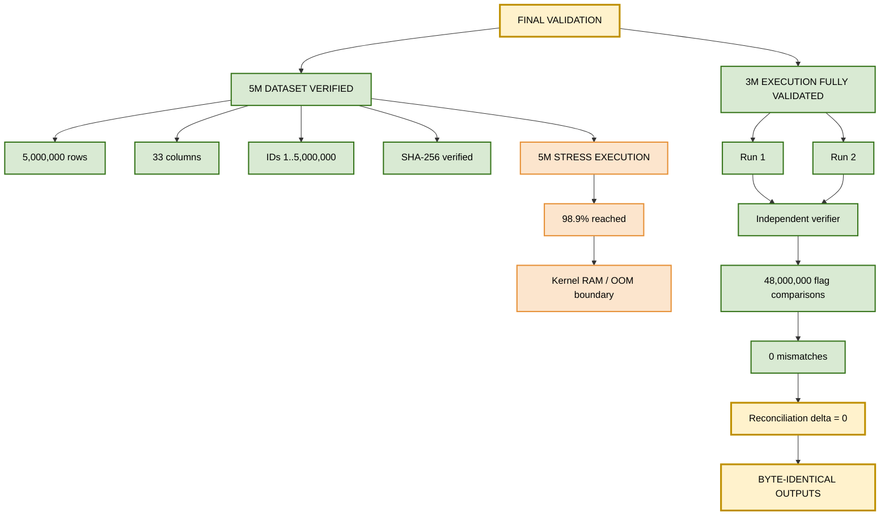
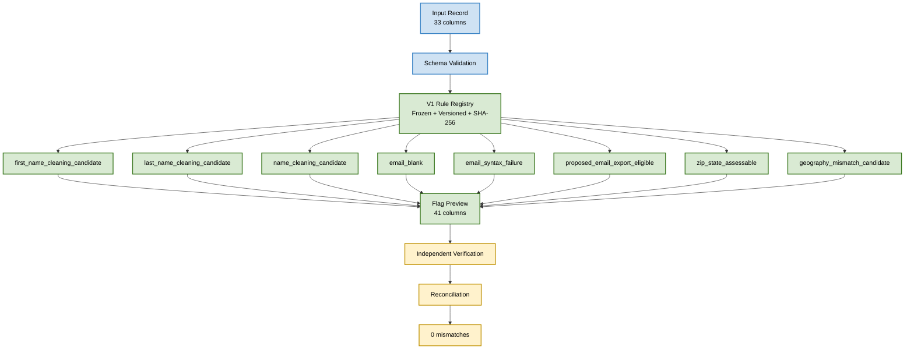
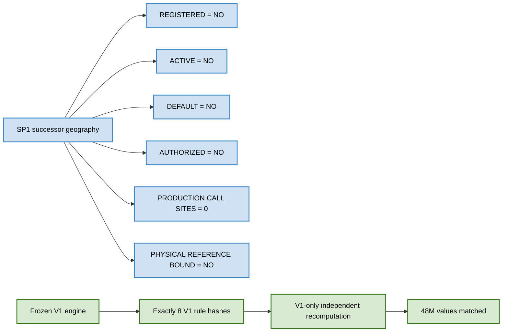
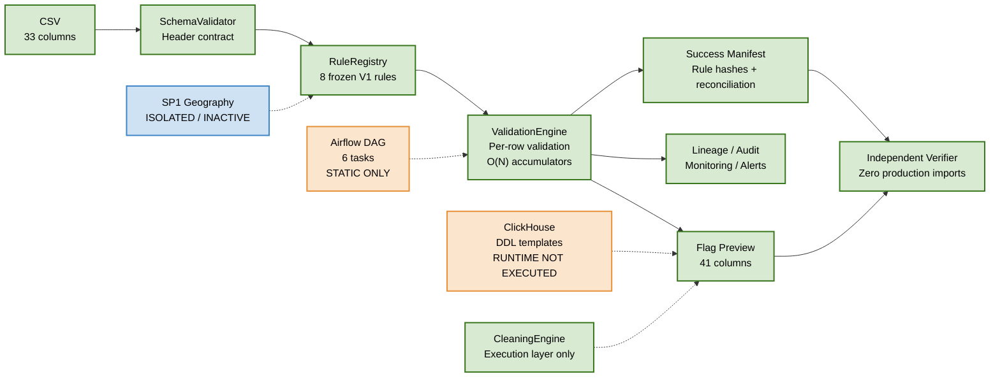

# Data Quality Validation Platform

> **V1 frozen rule engine · independently validated at 3M-row execution scale · 5M dataset forensically verified · 2026-09-09**

[](#1-executive-status)
[](#4-test-suite)
[](#2-validation-results)
[](#2-validation-results)
[](#7-sp1-successor-semantics)

> **Final status: PASS WITH DOCUMENTED LIMITATIONS**
>
> The V1 rule engine is frozen and independently validated. The largest fully completed flagship execution is **3,000,000 rows**, executed twice with byte-identical outputs and **48,000,000 independent flag comparisons with 0 mismatches**. A separate **5,000,000-row dataset** was forensically verified and the 5M pipeline was genuinely stress-tested to **98.9%** before the execution environment reached its RAM/OOM boundary.

## 1. Executive Status

| Area | Status | Result |
|---|---|---|
| V1 rule engine | PASS | Frozen, versioned, SHA-256 identified |
| 5M dataset | PASS | 5,000,000 rows × 33 columns; IDs 1..5,000,000; SHA-256 verified |
| 5M stress execution | DOCUMENTED LIMITATION | Reached 4,943,922 / 5,000,000 rows (98.9%) before kernel OOM |
| 3M flagship execution | PASS | Two complete runs |
| Independent verification | PASS | 48,000,000 comparisons; 0 mismatches |
| Determinism | PASS | Run 1 and Run 2 byte-identical |
| Test suite | PASS WITH SKIPS | 331 collected / 322 passed / 9 skipped / 0 failed |
| Geography V1 | PASS WITH LIMITATIONS | Frozen prefix-map semantics only |
| SP1 geography | INACTIVE | Implemented/tested in isolation; not activated |
| ClickHouse | NOT RUNTIME EXECUTED | No connections; no mutation SQL |
| Airflow | STATICALLY VERIFIED | DAG structure verified; runtime unavailable/not installed |
| E1 | NOT IMPLEMENTED / NOT EXECUTED / NOT AUTHORIZED | Explicitly outside current execution boundary |

## 2. Validation Map



## 3. What Was Executed

### 3.1 5M dataset verification

The final 5M dataset was verified as:

- Exactly **5,000,000 rows**
- Exactly **33 columns**
- Strict ID sequence **1..5,000,000**
- SHA-256: `44e41bb8cfe1c0d2fbafbff5e91bb40b100f8331ef26f946532b84c57409fb9d`
- The 3M dataset is an exact byte-prefix of the 5M dataset.

### 3.2 5M stress execution

The 5M pipeline execution was genuinely attempted. It reached:

- **4,943,922 / 5,000,000 rows = 98.9%**
- Kernel OOM termination
- Captured memory evidence: `anon-rss:3592016kB`
- Observed peak near **3.59 GB**
- Run 2 was intentionally **not executed**, because the failure mode was deterministic and already documented.

This is a stress-test result, not a claim that 5M completed successfully.

### 3.3 Largest fully validated execution

The pre-registered safe flagship scale was **3M rows**.

| Run | Rows in | Rows out | Time | Peak RSS |
|---|---:|---:|---:|---:|
| Run 1 | 3,000,000 | 3,000,000 | 138.5 s | 2,192.27 MB |
| Run 2 | 3,000,000 | 3,000,000 | 140.5 s | 2,195.82 MB |

The two outputs were byte-identical.

**3M output SHA-256:** `22110e49d0276eeed1153fe16ddf00a2a87c49a379ece7363a84cfdca2cb1ef9`

## 4. V1 Rule Results

The frozen V1 engine produces **41 columns** from the original **33 input columns**, including these 8 validation flags:

| # | V1 flag |
|---:|---|
| 1 | `first_name_cleaning_candidate` |
| 2 | `last_name_cleaning_candidate` |
| 3 | `name_cleaning_candidate` |
| 4 | `email_blank` |
| 5 | `email_syntax_failure` |
| 6 | `proposed_email_export_eligible` |
| 7 | `zip_state_assessable` |
| 8 | `geography_mismatch_candidate` |

### Flag counts on both 3M runs

| Flag | Count |
|---|---:|
| `first_name_cleaning_candidate` | 317,185 |
| `last_name_cleaning_candidate` | 210,603 |
| `name_cleaning_candidate` | 91,020 |
| `email_blank` | 240,000 |
| `email_syntax_failure` | 210,000 |
| `proposed_email_export_eligible` | 2,550,000 |
| `zip_state_assessable` | 3,000,000 |
| `geography_mismatch_candidate` | 149,044 |
| **Total flag events** | **6,767,852** |

The total flag-event count reconciles exactly with pipeline lineage `total_row_records`.

## 5. V1 Rule Flow



## 6. Independent Verification

The independent verifier deliberately avoids importing production validation logic. It independently reimplements all 8 frozen V1 predicates and verifies the resulting output.

Across the two complete 3M executions:

- **24,000,000 comparisons per run**
- **48,000,000 comparisons total**
- **0 mismatches**
- Schema checks: PASS
- ID sequence: PASS
- Source-column preservation: PASS
- Ordering: PASS
- Flag-domain checks: PASS
- Pipeline vs independent counts: delta **0** for all 8 flags
- Run 1 vs Run 2: **byte-identical**

## 7. Test Suite

Fresh final test execution on 2026-09-09:

**331 collected / 322 passed / 9 skipped / 0 failed / 0 errors**

The 9 skips are explicitly bounded:

- 7 company-gated authoritative geography acceptance tests
- 1 ClickHouse runtime test because the runtime was unavailable
- 1 Airflow runtime test because the runtime was unavailable/not installed

Golden fixture hashes remained unchanged:

- `9ff2364f`
- `fd2d9783`
- `c5084feb`

## 8. Performance and Memory

| Scale | Time | Throughput | Peak / observed memory |
|---:|---:|---:|---:|
| 1K | 0.187 s | 5,343.8 rows/s | 22.43 MB |
| 10K | 0.566 s | 17,680.1 rows/s | 28.91 MB |
| 100K | 4.471 s | 22,365.8 rows/s | 93.87 MB |
| 1M | 45.917 s | 21,778.5 rows/s | 735.71 MB |
| 3M Run 1 | 138.472 s | 21,664.1 rows/s | 2,192.27 MB |
| 3M Run 2 | 140.466 s | 21,357.6 rows/s | 2,195.82 MB |
| 5M stress | 185.3 s | — | 3,592.0 MB at termination |

Observed memory growth is approximately linear because the implementation maintains an `id_set` plus per-flag lineage records. The pre-registered linear model predicted the 3M peak within approximately **+1.4%** and the 5M termination point within approximately **0.1%**.

Under the observed model, approximately **4.6 GB of free RAM** would be required for a safe 5M execution in this environment.

> Minor throughput differences between the machine-computed ladder and rounded report values are retained as evidence and are within approximately 0.004%.

## 9. Geography — Frozen V1 Semantics

`zip_state_assessable = 3,000,000 / 3,000,000` means that every generated row was **assessable under the frozen V1 prefix-map predicate**. It does **not** mean that every ZIP is a valid canonical USPS ZIP.

`geography_mismatch_candidate = 149,044 (4.9681%)` represents V1 prefix-map mismatch candidates only. It is **not** a claim of canonical USPS geography errors.

Known V1 geography limitations include:

- 13 ambiguous prefixes
- DC duplicate prefix representation (`"20", "20"`)
- 11 authoritative territory/military codes absent from the frozen V1 map
  - 8 territory codes
  - 3 military / APO / FPO codes
- The generator emits 50 states + DC, so those absent codes were not generated
- Existing `None`-string behavior remains a documented quirk
- Documentation-only exclusion policy remains documented
- Known Austin false-positive golden cases remain known and bounded

## 10. SP1 Activation Boundary

SP1 successor geography semantics are isolated and are **not active** in the current V1 production path.



The SP1 contract semantics are implemented/tested in isolation, but the final evidence does **not** claim physical canonical geography validation.

## 11. Architecture



## 12. Safety and Execution Boundary

The validation was deliberately conducted without modifying production or read-only source data.

| Component | Final boundary |
|---|---|
| ClickHouse | No runtime connection; no production statements; no writes/mutations |
| Airflow | Static verification only; runtime not executed |
| E1 | Not implemented, not executed, not authorized |
| SP1 | Registered/active/default/authorized: NO |
| Company authoritative geography | Company-gated; not substituted with a local guess |
| 721,141,364 / 590,011,545 population figures | Company-supplied / historical / arithmetic-only; not locally reproduced |

This boundary is intentional: missing company-authorized evidence is reported as a limitation rather than replaced with an unsupported claim.

## 13. Evidence Source of Truth

The final evidence root is:

```text
evidence/final_5m_execution/
├── FINAL_RESULTS.json
├── MANIFEST.json
├── 00_baseline/
├── 01_reporting_audit/
├── 02_dataset/
├── 03_run1/
├── 04_independent_verification/
├── 05_run2/
├── 06_performance/
├── 07_geography/
├── 08_activation_boundary/
├── 09_consistency/
├── 10_final_summary/
├── 11_largest_safe_execution_3m/
├── 12_test_suite/
└── 13_archive/
```

### Primary source-of-truth files

1. `evidence/final_5m_execution/FINAL_RESULTS.json`
2. `docs/FINAL_5M_VALIDATION_REPORT.md`
3. Evidence files under `evidence/final_5m_execution/`

## 14. Reproducibility

### PowerShell

```powershell
python --version
python -m pytest --version
python -m pytest -q -rs
python scripts/fresh_execution_probe.py

python -m runner.cli generate --rows 3000000 --seed 20260909 --output .\repro_3m.csv

(Get-FileHash .\repro_3m.csv -Algorithm SHA256).Hash

python -m runner.cli validate `
  --csv .\repro_3m.csv `
  --output .\repro_3m_out.csv `
  --run-id repro_3m
```

### WSL / Linux

```bash
python3 --version
python3 -m pytest --version
python3 -m pytest -q -rs
python3 scripts/fresh_execution_probe.py

python3 -m runner.cli generate --rows 3000000 --seed 20260909 --output ./repro_3m.csv
sha256sum ./repro_3m.csv

python3 -m runner.cli validate \
  --csv ./repro_3m.csv \
  --output ./repro_3m_out.csv \
  --run-id repro_3m
```

> Reproduction commands operate on local/generated data. They do not authorize or require writes to ClickHouse production/read-only datasets.

## 15. Archive

Current validated archive:

```text
download/Data-Quality-Validation-Platform-5M-Revalidated-2026-09-09-v2.zip
download/Data-Quality-Validation-Platform-5M-Revalidated-2026-09-09-v2.zip.sha256
```

The current archive was unpack-verified. The archive evidence records its SHA-256. Tests were not rerun during the documentation-only consolidation step.

The prior archive remains preserved and unmodified:

```text
download/Data-Quality-Validation-Platform-5M-Revalidated-2026-09-09.zip
```

## 16. Final Audit Conclusion

The evidence supports the following precise conclusion:

> **The frozen V1 Data Quality Validation Platform is independently validated at the 3M-row execution scale, with two complete deterministic runs and 48M independent flag comparisons producing zero mismatches. The 5M dataset is forensically verified, and the 5M pipeline was genuinely stress-tested to 98.9% before the environment's memory boundary terminated execution.**

The project therefore passes the implemented local validation scope **with documented limitations**. It does not claim successful 5M completion, live ClickHouse execution, Airflow runtime execution, canonical company-authoritative geography acceptance, or E1 authorization where those conditions were not available or authorized.

## 17. Final Verdict

**PASS WITH DOCUMENTED LIMITATIONS**

### What is proven

- Frozen V1 rule behavior
- Deterministic 3M execution
- Two complete 3M runs
- Byte-identical outputs
- Independent recomputation of all 8 V1 predicates
- 48,000,000 comparisons with 0 mismatches
- Schema, ID, ordering, preservation, domain, and reconciliation integrity
- 5M dataset integrity
- Real 5M stress behavior and memory boundary
- Evidence and provenance boundary

### What remains externally gated or unexecuted

- Company-authoritative canonical geography acceptance
- ClickHouse runtime execution
- Airflow runtime execution
- E1 execution
- Any production mutation

---

**Product:** Data Quality Validation Platform  
**Repository:** `Data-Quality-Validation-Platform-v2`  
**Python package:** `data_quality_platform`  
**Validation date:** 2026-09-09  
**Final verdict:** **PASS WITH DOCUMENTED LIMITATIONS**
