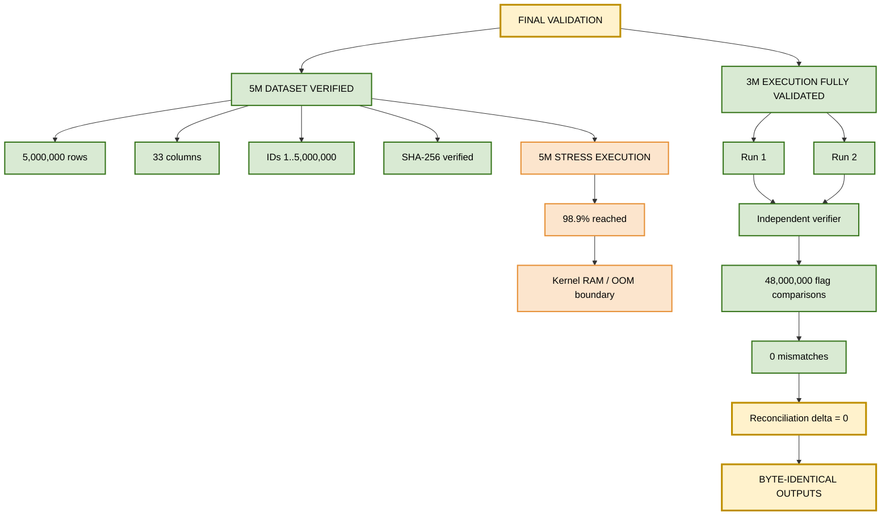
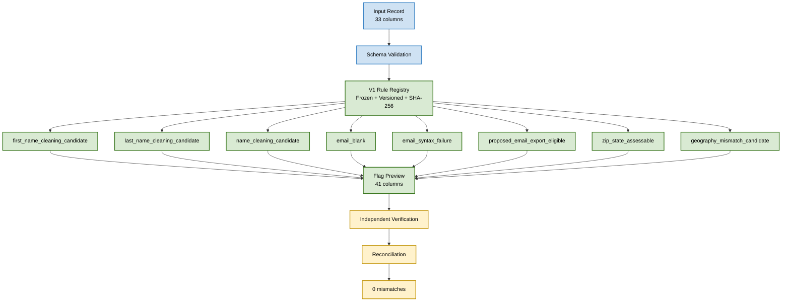
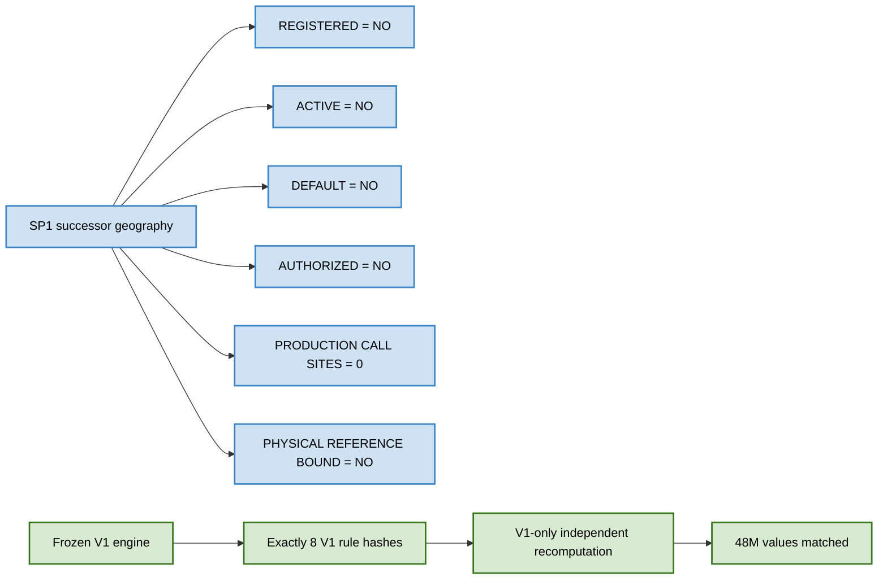
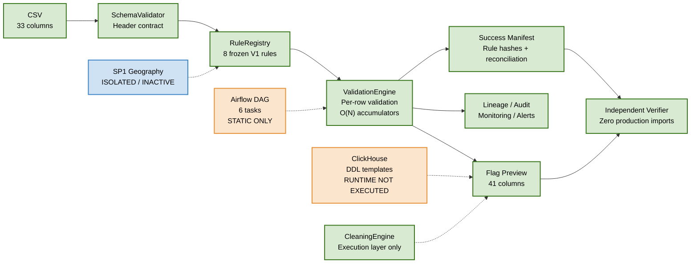

# Data Quality Validation Platform

> **V1 frozen rule engine · independently validated at 3M-row execution scale · 5M dataset forensically verified · SP1 successor geography contract implemented for validation only · 2026-09-10**

[](#1-executive-status)
[](#7-test-suite)
[](#2-validation-results)
[](#2-validation-results)
[](#10-sp1-successor-geography-contract)

> **Final status: PASS WITH DOCUMENTED LIMITATIONS**
>
> The V1 rule engine is frozen and independently validated. The largest fully completed flagship execution is **3,000,000 rows**, executed twice with byte-identical outputs and **48,000,000 independent flag comparisons with 0 mismatches**. A separate **5,000,000-row dataset** was forensically verified and the 5M pipeline was genuinely stress-tested to **98.9%** before the execution environment reached its RAM/OOM boundary. The **SP1 successor geography contract** (Gulnara, prepared 2026-09-01) is implemented and tested **for local validation only** — inactive, non-default, not production validated, and not authorized for execution.

## 1. Executive Status

| Area | Status | Result |
|---|---|---|
| V1 rule engine | PASS | Frozen, versioned, SHA-256 identified |
| 5M dataset | PASS | 5,000,000 rows × 33 columns; IDs 1..5,000,000; SHA-256 verified |
| 5M stress execution | DOCUMENTED LIMITATION | Reached 4,943,922 / 5,000,000 rows (98.9%) before kernel OOM |
| 3M flagship execution | PASS | Two complete runs |
| Independent verification | PASS | 48,000,000 comparisons; 0 mismatches |
| Determinism | PASS | Run 1 and Run 2 byte-identical |
| Test suite | PASS WITH SKIPS | 400 collected / 391 passed / 9 skipped / 0 failed / 0 errors (2026-09-10) |
| Geography V1 | PASS WITH LIMITATIONS | Frozen prefix-map semantics only |
| SP1 successor geography | INACTIVE | Contract defined; implemented/tested for validation only; not activated |
| SP1 activation | NOT AUTHORIZED | No production call sites; physical references not bound |
| DL001–DL015 | COMPANY-GATED | Authoritative table never delivered; 7 tests skip-gated; count of 8 divergences preserved and corroborated by derived analysis |
| ClickHouse | NOT RUNTIME EXECUTED | No connections; no mutation SQL |
| Airflow | STATICALLY VERIFIED | DAG structure verified; runtime unavailable/not installed |
| E1 | NOT IMPLEMENTED / NOT EXECUTED / NOT AUTHORIZED | Explicitly outside current execution boundary |
| R3 formula | UNRESOLVED | Business meaning approved; exact computational formula remains unresolved |

## 2. Validation Map



## 3. What Was Executed

### 3.1 5M dataset verification

The final 5M dataset was verified as:

- Exactly **5,000,000 rows**
- Exactly **33 columns**
- Strict ID sequence **1..5,000,000**
- SHA-256: `44e41bb8cfe1c0d2fbafbff5e91bb40b100f8331ef26f946532b84c57409fb9d`
- The 3M dataset is an exact byte-prefix of the 5M dataset.

### 3.2 5M stress execution

The 5M pipeline execution was genuinely attempted. It reached:

- **4,943,922 / 5,000,000 rows = 98.9%**
- Kernel OOM termination
- Captured memory evidence: `anon-rss:3592016kB`
- Observed peak near **3.59 GB**
- Run 2 was intentionally **not executed**, because the failure mode was deterministic and already documented.

This is a stress-test result, not a claim that 5M completed successfully.

### 3.3 Largest fully validated execution

The pre-registered safe flagship scale was **3M rows**.

| Run | Rows in | Rows out | Time | Peak RSS |
|---|---:|---:|---:|---:|
| Run 1 | 3,000,000 | 3,000,000 | 138.5 s | 2,192.27 MB |
| Run 2 | 3,000,000 | 3,000,000 | 140.5 s | 2,195.82 MB |

The two outputs were byte-identical.

**3M output SHA-256:** `22110e49d0276eeed1153fe16ddf00a2a87c49a379ece7363a84cfdca2cb1ef9`

## 4. V1 Rule Results

The frozen V1 engine produces **41 columns** from the original **33 input columns**, including these 8 validation flags:

| # | V1 flag |
|---:|---|
| 1 | `first_name_cleaning_candidate` |
| 2 | `last_name_cleaning_candidate` |
| 3 | `name_cleaning_candidate` |
| 4 | `email_blank` |
| 5 | `email_syntax_failure` |
| 6 | `proposed_email_export_eligible` |
| 7 | `zip_state_assessable` |
| 8 | `geography_mismatch_candidate` |

### Flag counts on both 3M runs

| Flag | Count |
|---|---:|
| `first_name_cleaning_candidate` | 317,185 |
| `last_name_cleaning_candidate` | 210,603 |
| `name_cleaning_candidate` | 91,020 |
| `email_blank` | 240,000 |
| `email_syntax_failure` | 210,000 |
| `proposed_email_export_eligible` | 2,550,000 |
| `zip_state_assessable` | 3,000,000 |
| `geography_mismatch_candidate` | 149,044 |
| **Total flag events** | **6,767,852** |

The total flag-event count reconciles exactly with pipeline lineage `total_row_records`.

## 5. V1 Rule Flow



## 6. Independent Verification

The independent verifier deliberately avoids importing production validation logic. It independently reimplements all 8 frozen V1 predicates and verifies the resulting output.

Across the two complete 3M executions:

- **24,000,000 comparisons per run**
- **48,000,000 comparisons total**
- **0 mismatches**
- Schema checks: PASS
- ID sequence: PASS
- Source-column preservation: PASS
- Ordering: PASS
- Flag-domain checks: PASS
- Pipeline vs independent counts: delta **0** for all 8 flags
- Run 1 vs Run 2: **byte-identical**

## 7. Test Suite

Fresh final test execution on **2026-09-10** (SP1 successor contract integration):

**400 collected / 391 passed / 9 skipped / 0 failed / 0 errors**

The 9 skips are explicitly bounded (unchanged from the 2026-09-09 state):

- 7 company-gated authoritative geography acceptance tests (DL001–DL015 table never delivered)
- 1 ClickHouse runtime test because the runtime was unavailable
- 1 Airflow runtime test because the runtime was unavailable/not installed

Test-count movement vs the 2026-09-09 state (331/322/9): +69 newly added
successor-contract validation tests
(`tests/unit/test_sp1_successor_contract_validation.py`). No pre-existing
test was modified, weakened, or deleted. Category runs:

- unit 306 passed · contract 22 passed · golden 25 passed + 7 skipped ·
  integration 24 passed · security 6 passed · runtime 8 passed + 2 skipped
- targeted SP1 successor tests: **132 passed**
  (63 pre-existing + 69 new) · V1 rules regression: 54 passed

Golden fixture hashes remained unchanged:

- `9ff2364f`
- `fd2d9783`
- `c5084feb`

Historical test evidence for prior states (331/322/9 of 2026-09-09) is
preserved in `evidence/final_5m_execution/12_test_suite/` and
`evidence/final_execution/`.

## 8. Performance and Memory

| Scale | Time | Throughput | Peak / observed memory |
|---:|---:|---:|---:|
| 1K | 0.187 s | 5,343.8 rows/s | 22.43 MB |
| 10K | 0.566 s | 17,680.1 rows/s | 28.91 MB |
| 100K | 4.471 s | 22,365.8 rows/s | 93.87 MB |
| 1M | 45.917 s | 21,778.5 rows/s | 735.71 MB |
| 3M Run 1 | 138.472 s | 21,664.1 rows/s | 2,192.27 MB |
| 3M Run 2 | 140.466 s | 21,357.6 rows/s | 2,195.82 MB |
| 5M stress | 185.3 s | — | 3,592.0 MB at termination |

Observed memory growth is approximately linear because the implementation maintains an `id_set` plus per-flag lineage records. The pre-registered linear model predicted the 3M peak within approximately **+1.4%** and the 5M termination point within approximately **0.1%**.

Under the observed model, approximately **4.6 GB of free RAM** would be required for a safe 5M execution in this environment.

> Minor throughput differences between the machine-computed ladder and rounded report values are retained as evidence and are within approximately 0.004%.

## 9. Geography — Frozen V1 Semantics

`zip_state_assessable = 3,000,000 / 3,000,000` means that every generated row was **assessable under the frozen V1 prefix-map predicate**. It does **not** mean that every ZIP is a valid canonical USPS ZIP.

`geography_mismatch_candidate = 149,044 (4.9681%)` represents V1 prefix-map mismatch candidates only. It is **not** a claim of canonical USPS geography errors.

Known V1 geography limitations include:

- 13 ambiguous prefixes
- DC duplicate prefix representation (`"20", "20"`)
- 11 authoritative territory/military codes absent from the frozen V1 map
  - 8 territory codes
  - 3 military / APO / FPO codes
- The generator emits 50 states + DC, so those absent codes were not generated
- Existing `None`-string behavior remains a documented quirk
- Documentation-only exclusion policy remains documented
- Known Austin false-positive golden cases remain known and bounded

## 10. SP1 Successor Geography Contract

The **authoritative current contract** is the Gulnara successor geography
document ("Geography rule - canonical definition and acceptance cases",
prepared 2026-09-01, measurements 2026-08-31). It **supersedes the previous
SP1 policy**; the old rule is retained only as frozen V1 history.

### 10.1 Current SP1 selection policy (supersedes the old policy)

```
exclude when:
    geography_mismatch_candidate = 1
    OR
    NOT field_present(requested geography field)
```

This **supersedes** the old policy `exclude when zip_state_assessable = 0
OR geography_mismatch_candidate = 1`. The core principle of the successor
contract is **UNASSESSABLE ≠ MISMATCH**: an unassessable row is not a
negative geography finding; only a mismatch row (which is assessable by
definition) is excluded on geography grounds. This applies to **every
targeted geography field** — it is not ZIP/state-only logic, and presence
is evaluated **per field, not once per row**.

### 10.2 `zip_state_assessable` semantics (successor)

All fields are read as text; surrounding whitespace is trimmed; NULL
becomes empty; state is uppercased.

```
zip5 = zip if trimmed zip matches ^[0-9]{5}$ else ''

reference_resolved =
    zip5 != ''
    AND canonical_state_count = 1
    AND cross_state_count <= 1
    AND (cross_state_count = 0 OR canonical_state = cross_state)

zip_state_assessable =
    reference_resolved
    AND NOT blank_state
    AND NOT invalid_state_format
    AND NOT numeric_state_review
    AND NOT unknown_state_code
```

with `blank_state = state = ''`;
`invalid_state_format = state != '' AND not ^[A-Za-z]{2}$ AND not all digits`;
`numeric_state_review = state != '' AND all digits`;
`unknown_state_code = two-letter state AND not in the approved 62-code
allowlist` (50 states + DC + 8 territories + 3 military codes, including
GU/AS/AA/AE/AP).

### 10.3 `geography_mismatch_candidate` semantics (successor)

Mismatch is evaluated **only when the row is assessable**:

```
geography_mismatch_candidate = zip_state_assessable AND consumer_state != canonical_state
```

Therefore mismatch ≠ unassessable: a malformed ZIP or a reference conflict
makes the row unassessable (mismatch = 0), never a negative geography
finding. This distinction is preserved in the implementation, tests, and
evidence.

### 10.4 `field_present` semantics (per field)

```
field_present(zip)     = zip5 != ''
field_present(state)   = NOT blank/invalid/numeric/unknown state
field_present(city)    = trimmed city != ''
field_present(address) = trimmed address != ''
field_present(county)  = NOT DEFINED   (refused - no invented logic)
field_present(country) = NOT DEFINED   (refused - no invented logic)
```

A row with a valid state and a malformed ZIP is present for
state-targeted selection and not present for ZIP-targeted selection.
County/country are out of scope; the implementation raises rather than
invent presence logic.

### 10.5 Canonical / cross reference model

The contract defines **two references** (canonical and cross), each
filtered to valid 5-digit ZIPs and two-letter states and grouped by ZIP:

- canonical must resolve a ZIP to exactly one state
- cross may have no row (not a conflict) or agree with canonical
- cross disagreement or canonical ambiguity → **not assessable**

The physical reference datasets (derived from `tips_data.tblZipStCtyIB`)
are **not available** in this repository. Per the no-fabrication rule, no
physical database/table binding is configured; the successor is implemented
behind an injectable `TwoReferenceProvider` interface, and all tests use
**clearly-labeled validation fixtures only** — never called production
references, and no objective production correctness is claimed.

### 10.6 Seven authoritative acceptance cases (all passing)

| # | State / ZIP | assessable | match | mismatch | Note |
|---|---|---:|---:|---:|---|
| 1 | CA / 90210 | 1 | 1 | 0 | baseline match |
| 2 | CA / 00USA | 0 | 0 | 0 | malformed ZIP → unassessable, NOT mismatch |
| 3 | CA / 0 | 0 | 0 | 0 | unassessable |
| 4 | CA / 000CA | 0 | 0 | 0 | unassessable |
| 5 | CA / "015 8" | 0 | 0 | 0 | unassessable |
| 6 | WA / 99501 | 1 | 0 | 1 | canonical resolution = AK |
| 7 | GU / 96910 | 1 | 1 | 0 | GU recognized; cross row absent is NOT a conflict |

### 10.7 DL001–DL015 forensic distinction

The authoritative DL001–DL015 acceptance table
(`tests/golden/dl_geography_cases.csv`) **was never delivered** to this
repository: the 7-test DL module is skip-gated by design and the table is
"never reconstructed" from other fixtures. Per the authoritative
description, the prefix-map (frozen V1) and canonical expected outputs
disagree on **8 of 15** cases; DL013 (UT / 84501) is a **control case**
(84501 resolves to Utah; a shared ZIP prefix is not automatically
erroneous). A 2026-09-10 derived forensic analysis
(`evidence/sp1_successor_2026-09-10/`) executed the real frozen V1 rules
against contract-derived canonical expectations for the 12 exactly-specified
cases and reproduced **exactly 8 disagreements** (DL001, DL002, DL003,
DL010, DL011, DL012, DL014, DL015), with DL005/DL007 provably agreeing and
DL006 consistent under the non-US-state reading. The repository's recorded
count of 8 is preserved; the authoritative count itself remains **not
verified against the external table** (never delivered).

### 10.8 SP1 status boundary (validation-only)

| Status field | Value |
|---|---|
| DEFINED | YES |
| IMPLEMENTED_FOR_VALIDATION | YES |
| ACTIVE | NO |
| DEFAULT | NO |
| PRODUCTION_VALIDATED | NO |
| AUTHORIZED_TO_EXECUTE | NO |

SP1 successor semantics live in `data_quality_platform/geography/` (pure,
isolated, injectable reference provider). The production `RuleRegistry`
still registers **exactly the 8 frozen V1 rules**; the successor is not
registered, not routed into the validation engine, has no production call
sites, and no physical reference binding. V1 prefix-map semantics, the
33→41 column contract, V1 rule hashes, and all historical evidence are
unchanged.



### 10.9 Provenance and company figures

- The successor provenance (contract_v3 / decision_record_v2 /
  pinned_template / geography_rule_summary.md hashes, source commit
  `ee7859e1…`) is recorded as **provenance metadata only, not execution
  evidence**, in `evidence/sp1_successor_2026-09-10/successor_provenance_record.json`.
- The manual delivery manifest **`manual_delivery_v1` is provenance, not
  execution evidence** — it is distinct from, and never merged with,
  Evidence Manifest v1. Recipient receipt: **not verified**.
- The 721M population figures (721,141,364 rows; 590,011,545 five-digit
  ZIP; 3,495,452 reference_missing; 37,195 reference_conflict;
  586,478,898 reference_resolved; 14,607,754 removed by state condition;
  571,871,144 assessable; 569,070,112 match; 2,801,032 mismatch) are
  **company-supplied / historical measurements; not independently
  reproduced in this repository**.
- ClickHouse production was **not executed**: zero connections, zero
  statements, zero mutations in this pass.
- **E1 was not implemented and not executed** (latitude/longitude backfill
  remains separately controlled; implementation_authorized = NO).
- **R3** (`name_cleaning_candidate`): business meaning approved
  (flag-only, inherited from R1/R2, summary/review signal); **exact
  computational formula remains unresolved** — the frozen V1
  implementation is preserved unchanged.

## 11. Architecture



## 12. Safety and Execution Boundary

The validation was deliberately conducted without modifying production or read-only source data.

| Component | Final boundary |
|---|---|
| ClickHouse | No runtime connection; no production statements; no writes/mutations |
| Airflow | Static verification only; runtime not executed |
| E1 | Not implemented, not executed, not authorized |
| SP1 | Defined + implemented for validation only; registered/active/default/authorized: NO |
| SP1 physical references | Not bound; validation fixtures only; no production reference claim |
| Company authoritative geography (DL001–DL015) | Company-gated; not substituted with a local guess; derived analysis clearly labeled |
| manual_delivery_v1 | Provenance only — not execution evidence, not merged with Evidence Manifest v1 |
| R3 formula | Unresolved; frozen V1 implementation preserved |
| 721,141,364 / 590,011,545 population figures | Company-supplied / historical / arithmetic-only; not locally reproduced |

This boundary is intentional: missing company-authorized evidence is reported as a limitation rather than replaced with an unsupported claim.

## 13. Evidence Source of Truth

The final evidence root is:

```text
evidence/final_5m_execution/          (V1 validation evidence, 2026-09-09 - historical, preserved)
evidence/sp1_successor_2026-09-10/    (SP1 successor integration evidence - NEW)
├── successor_provenance_record.json
├── dl001_dl015_derived_divergence_analysis.json
├── dl001_dl015_derived_divergence_report.txt
├── v1_preservation_and_evidence_integrity.json / .txt
├── phase3_contract_reconciliation.txt
├── test_runs/ (full_suite, sp1_targeted, v1_rules_regression,
│   golden_fixture_integrity, unit, contract, golden, integration,
│   security, runtime, dl_module_status + summary.json)
└── baseline / git state captures
```

### Primary source-of-truth files

1. `evidence/final_5m_execution/FINAL_RESULTS.json` (V1, 2026-09-09)
2. `docs/FINAL_5M_VALIDATION_REPORT.md` (V1, 2026-09-09)
3. `evidence/sp1_successor_2026-09-10/` (SP1 successor integration, 2026-09-10)
4. `docs/SP1_SUCCESSOR_FORENSIC_VALIDATION_REPORT_2026-09-10.md` (NEW forensic report)
5. Evidence files under `evidence/`

## 14. Reproducibility

### PowerShell

```powershell
python --version
python -m pytest --version
python -m pytest -q -rs
python scripts/fresh_execution_probe.py

python -m runner.cli generate --rows 3000000 --seed 20260909 --output .\repro_3m.csv

(Get-FileHash .\repro_3m.csv -Algorithm SHA256).Hash

python -m runner.cli validate `
  --csv .\repro_3m.csv `
  --output .\repro_3m_out.csv `
  --run-id repro_3m
```

### WSL / Linux

```bash
python3 --version
python3 -m pytest --version
python3 -m pytest -q -rs
python3 scripts/fresh_execution_probe.py

python3 -m runner.cli generate --rows 3000000 --seed 20260909 --output ./repro_3m.csv
sha256sum ./repro_3m.csv

python3 -m runner.cli validate \
  --csv ./repro_3m.csv \
  --output ./repro_3m_out.csv \
  --run-id repro_3m
```

> Reproduction commands operate on local/generated data. They do not authorize or require writes to ClickHouse production/read-only datasets.

## 15. Archive

Current validated archive (SP1 successor integration):

```text
download/Data-Quality-Validation-Platform-V2-SP1-Successor-Validated-2026-09-10.zip
download/Data-Quality-Validation-Platform-V2-SP1-Successor-Validated-2026-09-10.zip.sha256
```

The archive was unpack-verified in a second clean directory and the full
test suite was re-run from the extracted copy (see the forensic report,
section "Extracted-archive verification"). The archive contains source code,
tests, docs, the updated README, the new forensic report, the new SP1
successor evidence, provenance artifacts, and the validation artifacts
required for reproducibility; it contains no secrets, no credentials, no
caches, no virtual environments, and no large generated datasets.

Prior archives remain preserved and unmodified in the historical delivery
area (recorded in `DELIVERY_MANIFEST.json`):

```text
download/Data-Quality-Validation-Platform-5M-Revalidated-2026-09-09.zip
```

## 16. Final Audit Conclusion

The evidence supports the following precise conclusion:

> **The frozen V1 Data Quality Validation Platform is independently validated at the 3M-row execution scale, with two complete deterministic runs and 48M independent flag comparisons producing zero mismatches. The 5M dataset is forensically verified, and the 5M pipeline was genuinely stress-tested to 98.9% before the environment's memory boundary terminated execution. The SP1 successor geography contract (2026-09-01, integrated 2026-09-10) is defined and locally implemented/tested under the authoritative contract, while remaining inactive, non-default, not production validated, and not authorized for execution.**

The project therefore passes the implemented local validation scope **with documented limitations**. It does not claim successful 5M completion, live ClickHouse execution, Airflow runtime execution, canonical company-authoritative geography acceptance (DL001–DL015 remains company-gated), E1 authorization, or SP1 production activation where those conditions were not available or authorized.

## 17. Final Verdict

**PASS WITH DOCUMENTED LIMITATIONS**

### What is proven

- Frozen V1 rule behavior (8 rule hashes unchanged)
- Deterministic 3M execution
- Two complete 3M runs
- Byte-identical outputs
- Independent recomputation of all 8 V1 predicates
- 48,000,000 comparisons with 0 mismatches
- Schema, ID, ordering, preservation, domain, and reconciliation integrity
- 5M dataset integrity
- Real 5M stress behavior and memory boundary
- Evidence and provenance boundary
- SP1 successor contract semantics: 132/132 targeted tests, 7/7 authoritative acceptance cases, per-field presence, two-reference resolution, UNASSESSABLE ≠ MISMATCH invariant
- V1 freeze preservation: rule hashes, golden fixtures, 33→41 contract, and all historical evidence byte-identical after the 2026-09-10 integration

### What remains externally gated or unexecuted

- Company-authoritative canonical geography acceptance (DL001–DL015 table never delivered)
- Physical canonical/cross reference datasets (ClickHouse `tips_data.tblZipStCtyIB` not accessible)
- SP1 production activation and physical reference binding
- ClickHouse runtime execution
- Airflow runtime execution
- E1 implementation/execution
- Any production mutation
- Recipient receipt of manual_delivery_v1 (not verified)
- R3 exact computational formula (unresolved)

---

**Product:** Data Quality Validation Platform  
**Repository:** `Data-Quality-Validation-Platform-v2`  
**Python package:** `data_quality_platform`  
**V1 validation date:** 2026-09-09 · **SP1 successor integration:** 2026-09-10  
**Final verdict:** **PASS WITH DOCUMENTED LIMITATIONS**
